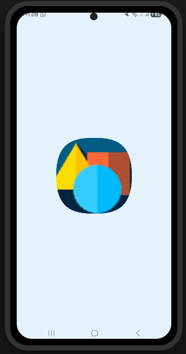
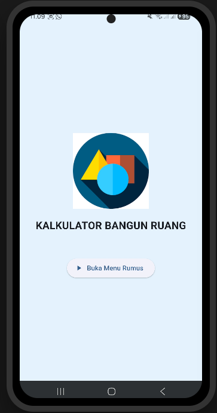
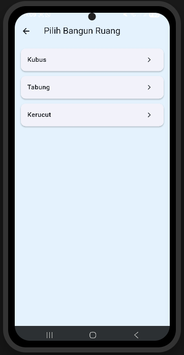
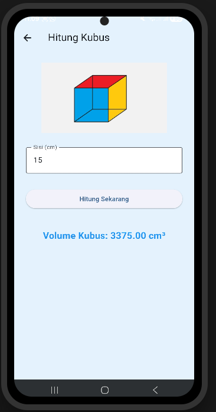
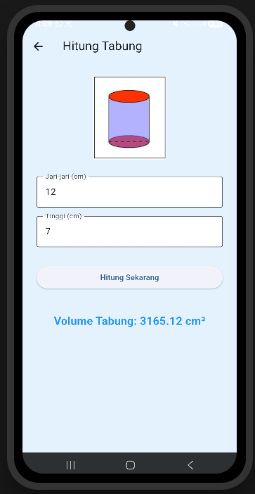
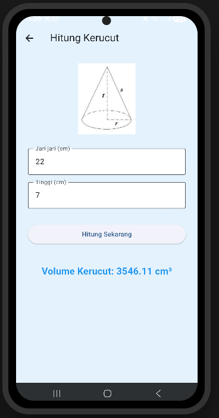

# 📐 Aplikasi Kalkulator Bangun Ruang

## 📖 Tentang Aplikasi
**Kalkulator Bangun Ruang** adalah aplikasi edukasi berbasis *mobile* yang dirancang khusus untuk mempermudah pengguna dalam menghitung volume berbagai bangun ruang tiga dimensi (3D) secara cepat, presisi, dan praktis. 

Aplikasi ini dibangun dengan fokus pada antarmuka yang bersih (*clean design*) dan navigasi yang intuitif, sehingga pengguna dari berbagai kalangan dapat langsung memahami cara menggunakannya tanpa kebingungan. Saat ini, sistem kalkulator mendukung perhitungan matematika untuk tiga bangun ruang utama, yaitu **Kubus, Tabung, dan Kerucut**, dengan rencana pengembangan (*scalability*) untuk bangun ruang lainnya di masa depan.

## 🛠️ Teknologi yang Digunakan
Aplikasi ini dikembangkan menggunakan *tech stack* modern untuk pengembangan lintas platform (*cross-platform*):
* **Framework:** Flutter (Mendukung performa *native* yang cepat)
* **Bahasa Pemrograman:** Dart
* **Desain UI/UX:** Material Design 3 (Memberikan tampilan yang segar dengan komponen antarmuka yang modern dan dinamis)
* **Package Tambahan:** `flutter_native_splash` (Diimplementasikan untuk menghasilkan transisi *loading* awal yang mulus dan profesional)

---

## 📱 Penjelasan Antarmuka (UI) Aplikasi

Berikut adalah alur dan detail tampilan antarmuka dari aplikasi Kalkulator Bangun Ruang:

### 1. Splash Screen


Tampilan ini adalah layar *loading* yang muncul sesaat ketika aplikasi pertama kali dibuka. Halaman ini menampilkan latar belakang biru muda yang senada dengan tema utama aplikasi beserta logo di bagian tengah, memberikan kesan mulus dan profesional sebelum sistem mengarahkan pengguna ke menu utama.

---

### 2. Halaman Utama (Welcome Screen)


Halaman ini merupakan tampilan penyambutan setelah *splash screen* selesai memuat data. Antarmukanya difokuskan di tengah layar, menampilkan logo aplikasi, teks judul utama **"KALKULATOR BANGUN RUANG"**, dan sebuah tombol interaktif **"Buka Menu Rumus"** yang berfungsi sebagai gerbang masuk pengguna ke fitur utama aplikasi.

---

### 3. Halaman Menu Pilihan


Halaman ini berfungsi sebagai pusat navigasi bagi pengguna untuk memilih jenis bangun ruang yang ingin dihitung. Antarmukanya menyajikan daftar menu dalam bentuk kartu (*Card*) interaktif yang disusun secara vertikal. Menu ini memuat pilihan **Kubus, Tabung, dan Kerucut**, dilengkapi dengan ikon panah (*chevron*) sebagai indikator visual bahwa kartu tersebut dapat diklik.

---

### 4. Halaman Kalkulator Kubus


Halaman operasional pertama yang dikhususkan untuk menghitung volume kubus. Antarmukanya secara visual menampilkan ilustrasi kubus di bagian atas sebagai panduan, diikuti dengan satu kolom input dinamis (*TextField*) untuk memasukkan nilai **"Sisi (cm)"**. Terdapat tombol **"Hitung Sekarang"** untuk mengeksekusi rumus, dan hasil akhirnya akan otomatis muncul dengan teks tebal berwarna biru di bagian bawah layar.

---

### 5. Halaman Kalkulator Tabung


Halaman ini dirancang khusus dengan algoritma perhitungan volume tabung. Antarmukanya menyediakan gambar panduan tabung dan dua kolom pengisian data angka untuk pengguna, yaitu **"Jari-jari (cm)"** dan **"Tinggi (cm)"**. Setelah pengguna menekan tombol **"Hitung Sekarang"**, sistem akan memproses nilai tersebut dan langsung merender hasilnya di layar.

---

### 6. Halaman Kalkulator Kerucut


Halaman terakhir pada versi ini berfungsi untuk menghitung volume kerucut. Mempertahankan konsistensi desain dari halaman sebelumnya, UI ini menampilkan ilustrasi kerucut beserta dua kolom input spesifik untuk nilai **"Jari-jari (cm)"** dan **"Tinggi (cm)"**. Tombol **"Hitung Sekarang"** akan memicu fungsi kalkulasi matematika dan menampilkan teks hasil perhitungan volume secara akurat.

---

## 🚀 Cara Menjalankan Aplikasi

Jika Anda ingin menjalankan atau mengembangkan kode sumber aplikasi ini di perangkat lokal, ikuti langkah-langkah berikut:

1. **Persiapan (Prerequisites):** Pastikan Anda sudah menginstal Flutter SDK dan IDE seperti Visual Studio Code atau Android Studio di komputer Anda.
2. **Buka Proyek:** Buka folder proyek ini menggunakan IDE pilihan Anda.
3. **Unduh Dependensi:** Buka terminal dan jalankan perintah berikut untuk mengunduh semua *package* yang dibutuhkan:
   ```bash
   flutter pub get
   ```
4. **Generate Splash Screen:** Karena aplikasi ini menggunakan konfigurasi *native splash screen*, jalankan perintah ini di terminal agar tampilan *loading* awal diterapkan ke sistem:
   ```bash
   flutter pub run flutter_native_splash:create
   ```
5. **Jalankan Aplikasi:** Pastikan emulator Android/iOS sudah menyala, atau sambungkan perangkat fisik Anda. Kemudian, jalankan perintah:
   ```bash
   flutter run
   ```